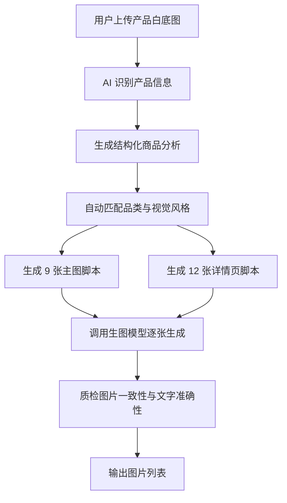

# 扣子编程生图能力迁移说明

本文档只描述核心生图能力：用户上传一张产品白底图，系统自动生成一套台湾虾皮电商主图 9 张，以及详情图 12 张。  
不包含登录、积分、支付、图片长期存储、后台管理等外围功能。

## 目标

让另一套 AI 工具具备以下能力：

1. 用户上传 1 张产品白底图。
2. 用户填写产品标题。
3. 用户可选填写产品功能、材质、尺寸、适用人群、画面风格等补充信息。
4. AI 自动识别产品品类、颜色、材质、目标人群、使用场景、核心卖点。
5. AI 自动选择适合该品类的电商主图风格。
6. AI 一次生成 9 张主图。
7. AI 分批生成 12 张详情图：前 6 屏、后 6 屏。
8. 每张图都有独立主题，但同一组图片保持统一视觉风格。

## 用户输入

最小必填输入：

```json
{
  "product_title": "磁吸手机支架",
  "product_image": "用户上传的产品白底图"
}
```

推荐可选输入：

```json
{
  "product_function": "真空吸附、360度旋转、折叠收纳",
  "material": "金属、ABS、硅胶",
  "size": "以用户填写为准",
  "target_audience": "车主、通勤用户",
  "visual_style": "黑色科技感、高级金属风",
  "extra_info": "适合车内中控、玻璃、仪表台"
}
```

如果用户没有填写可选项，AI 可以根据图片进行合理推断，但不得编造硬参数。

硬参数包括：

- 年龄
- 体重
- 承重
- 尺寸
- 材质
- 认证
- 检测标准
- 防水等级
- 适配车型
- 保固年限
- 配件清单

未确认时统一使用：

- `以賣場資訊為準`
- `內容物依實際出貨為準`
- 或直接省略该项

## 总流程



## 第一步：商品识别

上传图片后，先让多模态模型分析图片，输出结构化 JSON。

示例：

```json
{
  "product_category": "车载手机支架",
  "core_product_name": "磁吸手机支架",
  "color_style": "黑色科技感",
  "visible_materials": ["黑色金属", "塑料底座", "硅胶吸盘"],
  "visible_parts": ["圆形磁吸面板", "折叠支架", "旋转关节", "吸盘底座"],
  "visible_features": ["可旋转", "可折叠", "吸盘固定"],
  "likely_scenarios": ["车内中控", "仪表台", "挡风玻璃"],
  "target_audience": ["车主", "通勤用户", "需要导航支架的人群"],
  "risk_unknowns": ["具体承重未知", "磁力等级未知", "适配车型未知"]
}
```

商品识别要求：

- 必须识别产品真实品类。
- 必须保留产品颜色、形状、比例和可见结构。
- 必须区分“看得见的卖点”和“不能确认的信息”。
- 不能为了画面丰富而增加图片里没有的功能、配件、品牌或结构。

## 第二步：自动匹配视觉风格

系统不应该要求普通用户手动选择复杂风格。默认使用：

```text
Shopee AI 自动匹配
```

根据商品识别结果自动选择风格。

### 风格路由规则

#### 1. 黑色科技车用品

适用产品：

- 车载手机支架
- 磁吸支架
- 真空吸附支架
- 车载收纳件
- 黑色金属数码配件

视觉特征：

- 黑色、枪灰、金属质感
- 冷蓝、冰白、深 navy
- HUD 光效
- 车内中控场景
- 科技线条、发光吸附圈、工程感

文案方向：

- 真空吸附
- 稳固防抖
- 360 度旋转
- 折叠收纳
- 车内适用
- 精密质感

禁止：

- 可爱粉色风
- 厨房小家电风
- 未提供的 N52、120N、5kg、航空级、专利等硬参数

#### 2. 可爱居家小物

适用产品：

- 迷你封口机
- 塑封机
- 零食保鲜器
- 小型厨房工具
- 可爱造型小家电

视觉特征：

- 奶油色、粉色、浅黄
- 木纹桌面
- 下午窗光
- 圆角标签
- 可爱猫爪、软萌图形
- 居家厨房场景

文案方向：

- 一压即封
- 零食保鲜
- 轻巧便携
- 磁吸收纳
- USB 充电
- 防潮防霉

禁止：

- 冷硬科技风
- 过度黑蓝背景
- 未确认的保固、续航、配件

#### 3. 亲子安全用品

适用产品：

- 儿童座椅
- 儿童安全带辅助垫
- 婴幼儿出行用品
- 亲子车用品

视觉特征：

- 明亮车内或家庭场景
- 蓝白、暖橙、柔和背景
- 信任感图标
- 结构标注清晰

文案方向：

- 稳固支撑
- 透气舒适
- 多点固定
- 亲肤面料
- 便携安装
- 可拆清洗

禁止：

- 编造认证
- 编造适用年龄和体重
- 编造碰撞保护
- 编造承重

#### 4. 美妆保养健康感

适用产品：

- 精华
- 牙膏
- 口腔护理
- 清洁护理
- 香膏除臭

视觉特征：

- 干净高级
- 白色、金色、浅蓝
- 玻璃反光
- 成分感
- 清洁感

文案方向：

- 清爽
- 温和
- 日常护理
- 使用方便
- 香氛体验

禁止：

- 医疗疗效
- 治疗承诺
- 保证有效

#### 5. 质感生活家居

适用产品：

- 收纳盒
- 置物架
- 清洁工具
- 桌面用品
- 厨房用品
- 浴室用品

视觉特征：

- 高级生活场景
- 自然光
- 木质、中性色
- 干净留白

文案方向：

- 整齐
- 省空间
- 好清洁
- 好拿取
- 日常实用

#### 6. 通用橙色爆款

适用场景：

- AI 无法明确判断品类
- 用户没有提供风格偏好
- 产品不属于以上类别

视觉特征：

- 台湾虾皮橙色爆款风
- 粗体繁体中文
- 白描边
- 圆角信息块
- 高对比但不杂乱

## 第三步：生成 9 张主图

主图是列表点击率核心。生成顺序固定为 9 张。

### 主图 01：全方位主视觉

目标：

第一张图最重要，必须是“场景 + 核心卖点 + 商品主体”的爆款封面。

内容：

- 真实使用场景
- 商品主体占画面 35%-55%
- 主标题突出商品品类和最强卖点
- 2-4 个辅助卖点标签

示例文案：

- `車用固體香膏 強效除臭`
- `磁吸手機支架 狂抖不掉`
- `兒童安全座椅 安心出行`
- `零食保鮮 密封神器`

提示词重点：

```text
生成台湾虾皮电商主图 01，全方位主视觉。
画面必须有真实使用场景，不要只是白底产品图。
商品主体清晰突出，保留产品真实颜色、材质、比例和结构。
主标题使用「商品品类 + 最强核心卖点」。
搭配 2-4 个短标签强化购买理由。
整体风格由 AI 根据商品品类自动匹配。
文字必须使用繁体中文，粗体、大字、手机端可读。
```

### 主图 02：核心功能卖点图

目标：

把最核心功能视觉化。

常见方向：

- 稳固支撑
- 真空吸附
- 一压密封
- 防撞保护
- 强效除臭
- 大容量收纳

提示词重点：

```text
生成主图 02，突出产品最核心功能。
使用光效、箭头、放大框或功能线条解释该卖点。
不得添加图片中没有的结构或功能。
```

### 主图 03：多角度 / 结构展示图

目标：

让用户快速理解产品形态。

内容：

- 正面
- 侧面
- 背面
- 折叠 / 展开
- 局部结构

提示词重点：

```text
生成主图 03，多角度结构展示。
同一商品展示 2-3 个角度。
如果无法确认可折叠，不要生成折叠状态。
```

### 主图 04：升级对比图

目标：

通过对比解释为什么买本商品。

内容：

- 左侧：本商品
- 右侧：一般款
- 本商品用绿色勾
- 一般款用红色叉

可比较项目：

- 稳固 vs 易晃动
- 透气 vs 闷热
- 加厚 vs 薄款
- 可收纳 vs 占空间
- 可拆洗 vs 不易清洁

提示词重点：

```text
生成主图 04，左右对比图。
只比较图片可见或用户明确提供的卖点。
不得使用多国认证、承重、材质等级等未确认信息。
```

### 主图 05：商品规格表

目标：

用表格降低购买疑虑。

常见字段：

- 商品名称
- 适用情境
- 材质
- 尺寸
- 内容物
- 颜色

规则：

没有用户提供的信息，写 `以賣場資訊為準`。

提示词重点：

```text
生成主图 05，详细商品规格表。
使用圆角表格，文字清楚。
不能编造尺寸、材质、重量、适用年龄、承重。
```

### 主图 06：细节特写图

目标：

建立品质信任。

内容：

- 材质纹理
- 缝线
- 扣具
- 按键
- 接口
- 吸盘
- 防滑垫
- 图案

重要规则：

第 6 张必须延续整套主图风格，不能突然换色调。

提示词重点：

```text
生成主图 06，细节特写图。
展示 3 个真实可见细节。
细节必须来自同一件商品，颜色、结构、扣具、纹理必须一致。
整张图的背景、字体、标签、色调必须延续前 5 张主图风格。
```

### 主图 07：包装内容图

目标：

告诉用户会收到什么。

内容：

- 商品主体
- 已确认配件
- 已确认说明书
- 已确认包装盒

规则：

如果没有确认配件，不要画配件。

提示词重点：

```text
生成主图 07，包装内容图。
只展示用户提供或图片明确可见的内容物。
未知配件写「內容物依實際出貨為準」。
```

### 主图 08：使用情境图

目标：

建立生活代入感。

内容：

- 车内使用
- 厨房使用
- 居家使用
- 外出携带
- 亲子出行

提示词重点：

```text
生成主图 08，使用情境图。
根据产品品类选择最真实的使用场景。
可以有人物互动，但商品必须是主角。
```

### 主图 09：补充卖点 / 促销信任图

目标：

补充最后一个购买理由。

可选方向：

- 多色现货
- 售后保障
- 品质保障
- 场景扩展
- 品牌感
- 促销感

规则：

保固、售后、赠品必须由用户提供，否则不能编造。

提示词重点：

```text
生成主图 09，补充购买理由。
可以突出多色、场景、信任感或促销感。
不得编造保固、赠品、认证、平台 Logo。
```

## 第四步：生成 12 张详情图

详情图分两批生成：

- 前 6 屏
- 后 6 屏

这样可以降低一次生成过多导致超时或失败的风险。

### 详情页前 6 屏

#### 详情 01：功能总览

目标：

开场建立商品定位。

内容：

- 商品大图
- 主标题
- 3-4 个核心卖点图标

示例：

```text
Feature Overview
守護寶貝安全出行
輕量設計 / 五點式安全帶 / 通用安裝
```

#### 详情 02：痛点共鸣

目标：

提出用户痛点。

示例：

```text
Pain Point
傳統座椅太笨重？
佔空間且安裝繁瑣
```

规则：

不要制造恐惧，不要夸大风险。

#### 详情 03：解决方案

目标：

说明本商品如何解决痛点。

示例：

```text
Solution 展示
一拎即走 釋放空間
專為現代家庭設計輕量化方案
```

#### 详情 04：功能矩阵

目标：

用 4 个图标总结卖点。

示例：

```text
Function Matrix
全方位防護升級
加寬側翼 / 親膚面料 / 抗震底座 / 相容多車型
```

#### 详情 05：核心结构

目标：

标注关键结构。

示例：

```text
Core Structure
科學受力結構
加厚防護靠背 / 五點式卡扣 / 高彈透氣墊
```

#### 详情 06：规格概览

目标：

前半段收尾，整理规格。

示例：

```text
Specifications Table
產品規格一覽
適用情境：以賣場資訊為準
材質：以賣場資訊為準
固定方式：安全帶固定
內容物：以實際出貨為準
```

### 详情页后 6 屏

#### 详情 07：便携卖点

目标：

重新强化便携、出行、安装便利。

示例：

```text
便攜兒童安全座椅
安全守護出行
五點防護 / 透氣舒適 / 便攜免拆
```

#### 详情 08：折叠 / 形态展示

目标：

展示折叠、展开、正反面或多形态。

规则：

不可折叠商品改成多角度展示。

#### 详情 09：舒适体验

目标：

展示体验价值。

示例：

```text
全方位舒適體驗
加厚防撞 / 透氣網眼 / 可調織帶 / 環保無味
```

#### 详情 10：传统痛点

目标：

再次通过传统产品痛点强化购买理由。

示例：

```text
傳統座椅太笨重？
佔據空間拆卸麻煩
```

#### 详情 11：受力固定

目标：

标注受力点、固定点、连接点。

示例：

```text
五點式安全防護
肩部受力點 / 檔部受力點 / 腰部受力點 / 黑色卡扣
```

#### 详情 12：规格补充

目标：

最后补充下单前信息。

示例：

```text
產品規格一覽
適用年齡：以賣場資訊為準
材質：以賣場資訊為準
重量：以賣場資訊為準
尺寸：以賣場資訊為準
```

## 第五步：整组风格锁

同一组图必须保持一致。

风格锁规则：

```text
本次生成的所有主图必须像同一个商品系列、同一次设计产出的套图。
统一色彩、字体、描边、标签形状、图标风格、光效类型和背景质感。
可以更换构图，但不能突然切换到另一种色系或另一类电商模板。
如果前几张是黑蓝科技风，后续也必须是黑蓝科技风。
如果前几张是奶油可爱风，后续也必须是奶油可爱风。
如果前几张是橙色爆款风，后续也必须是橙色爆款风。
```

尤其注意：

第 6 张细节图最容易跑偏，必须额外强调：

```text
第 6 张细节特写图是同一套主图里的细节页，不是另一套详情页模板。
背景、色调、字体、标签和光效必须延续第 1-5 张的视觉系统。
不得突然出现与本组其他主图明显不同的橙色说明卡、暖色渐层、可爱风版式或科技风版式。
```

## 第六步：准确性规则

这是保证商业可用性的关键。

### 文案证据规则

每个卖点都必须来自：

1. 上传图片可见结构
2. 用户补充信息
3. 产品品类的保守常识

不能确认时，改成保守说法。

例如：

- 不确定是否防水：不要写 `防水`
- 不确定是否抗菌：不要写 `抗菌`
- 不确定是否认证：不要写 `多國認證`
- 不确定是否真皮：不要写 `真皮材質`

### 收纳词规则

只有当商品本身明确是收纳盒、收纳袋、置物架、置物篮时，才能使用：

- `收納空間`
- `收納盒`
- `大容量收納`

如果商品是儿童座椅、坐垫、保护垫，底部拉链或垫层不能写成收纳空间，应写：

- `可拆卸清洗`
- `清潔便利`
- `拉鍊設計`
- `底部加穩`

### 细节一致性规则

放大框、微距图、细节图必须像来自同一件商品。

必须保持：

- 颜色一致
- 扣具形状一致
- 织带位置一致
- 缝线方向一致
- 图案一致
- 材质纹理一致

### 扣具规则

如果原图只显示侧边扣、调节扣或织带扣，不要生成：

- 中央五点式圆扣
- 汽车安全带插扣
- 背包扣
- 其他不同形状扣具

如果无法准确复现扣具，就减少扣具特写，改拍：

- 织带
- 缝线
- 面料
- 边线

### 安全文案规则

可以写：

- `穩固`
- `支撐`
- `防護`
- `方便安裝`
- `舒適`

不要写：

- `絕對安全`
- `碰撞保護`
- `安全認證`
- `多國認證`
- `通過檢測`

除非用户明确提供证明。

## 第七步：提示词总模板

每张图生成时都使用这个总模板，再插入对应图片主题。

```text
你是专业台湾虾皮电商设计师和商品广告策划。
请基于用户上传的产品图，直接生成一张台湾虾皮电商图片。

图片类型：{主图 / 详情页}
图片编号：{编号}
图片主题：{主题}
画幅比例：{1:1 / 3:4 / 4:3 / 16:9 / 9:16}

开始创作前，请先在内部完成商品理解：
识别产品品类、可见结构、颜色材质、使用场景、目标受众、购买动机、可见卖点与不可确认信息。
这些分析不要输出成大段文字，只用于画面和文案决策。

商品名称：{product_title}
产品功能：{product_function 或 根据图片谨慎判断}
补充信息：{extra_info 或 未提供}
用户偏好画面风格：{visual_style 或 Shopee AI 自动匹配}

本张图片销售任务：
{插入该图主题说明}

画面要求：
1. 保留产品真实外观、颜色、材质、比例、结构和可见细节。
2. 使用台湾繁体中文。
3. 文案短、粗、大，适合手机端浏览。
4. 主标题不超过 10 个中文字。
5. 卖点标签每个不超过 8 个中文字。
6. 所有卖点必须有图片证据或用户补充信息支持。
7. 不得编造品牌、认证、承重、尺寸、材质、防水等级、保固或配件。
8. 不得新增原图没有的结构、口袋、配件、Logo 或明显不同的零件。
9. 同一组图片必须保持统一视觉风格。

如果无法同时保证文字准确和画面丰富，优先保证文字准确、产品一致和手机端可读性。
```

## 第八步：模型调用建议

### 适合电商主图

优先：

```text
kapon/gemini-3-pro-image-preview
```

适合：

- 主图风格强
- 电商感强
- 场景图、卖点图、爆款封面

建议参数：

```json
{
  "model": "kapon/gemini-3-pro-image-preview",
  "params": {
    "prompt": "完整提示词",
    "image_urls": ["公网可访问的产品图 URL"],
    "size": "1K",
    "image_size": "1:1",
    "aspect_ratio": "1:1",
    "watermark": false,
    "add_watermark": false
  }
}
```

### 适合中文电商图

可选：

```text
doubao-seedream-5-0-260128
```

建议参数：

```json
{
  "model": "doubao-seedream-5-0-260128",
  "prompt": "完整提示词",
  "size": "1920x1920",
  "response_format": "b64_json",
  "watermark": false,
  "add_watermark": false,
  "n": 1,
  "image": ["产品图 data URL"]
}
```

### 适合基于原图编辑

可选：

```text
openai/gpt-image-2/edit
```

适合：

- 尽量保持产品外观
- 基于原图生成新电商场景
- 修改局部画面

建议参数：

```json
{
  "model": "openai/gpt-image-2/edit",
  "params": {
    "prompt": "完整提示词",
    "image_urls": ["公网可访问的产品图 URL"],
    "image_size": "1:1",
    "aspect_ratio": "1:1",
    "resolution": "1K",
    "quality": "low",
    "num_images": 1,
    "output_format": "png",
    "watermark": false,
    "add_watermark": false
  }
}
```

### 适合纯文本生成

可选：

```text
openai/gpt-image-2
```

适合：

- 没有产品图时生成概念图
- 生成非严格产品一致性的广告图

对于电商产品图，不建议优先使用纯文本生成，因为产品一致性通常不如 edit 模式。

## 第九步：任务执行方式

不要一次性把 9 或 12 张图塞进一个模型请求。

推荐方式：

1. 先生成商品分析 JSON。
2. 根据分析结果生成整套图片计划。
3. 每张图单独生成一个 prompt。
4. 每张图单独调用一次生图模型。
5. 前端展示每张图的生成状态。
6. 单张失败时，只重试该张。
7. 用户点击“重新生成”时，只重新生成对应图片。

推荐并发：

- Banana Pro / 51aigc：最多 2-3 张并发
- Seedream：建议 1 张并发
- GPT Image：建议 1-2 张并发

超时时间：

- 单张图建议 5-10 分钟
- 批量生成建议采用任务轮询，不要让前端一直等待一个长请求

## 第十步：输出命名

主图命名：

```text
{核心产品名}-主图 01｜全方位主視覺.png
{核心产品名}-主图 02｜防護支撐圖.png
...
{核心产品名}-主图 09｜內部結構圖.png
```

详情图命名：

```text
{核心产品名}-详情图 01｜功能總覽.png
{核心产品名}-详情图 02｜痛點共鳴.png
...
{核心产品名}-详情图 12｜規格補充.png
```

如果用户产品标题是：

```text
儿童座椅 车用便携安全座椅
```

可提取核心产品名：

```text
儿童座椅
```

最终文件名：

```text
儿童座椅-主图 01｜全方位主視覺.png
```

## 第十一步：质检规则

生成后必须检查：

1. 产品是否像用户上传的原图。
2. 颜色是否一致。
3. 结构是否被改坏。
4. 是否新增了不存在的功能。
5. 是否编造了硬参数。
6. 繁体中文是否正确。
7. 是否混入简体字。
8. 文案是否能在手机上看清。
9. 同一组图的色调是否统一。
10. 单张图是否偏离整组风格。

如果出现以下问题，应该支持单张重新生成：

- 某张图色调明显不一致
- 某张图文案不准确
- 某张图产品结构错误
- 某张图文字乱码
- 某张图出现未确认参数

## 最小可实现版本

如果扣子编程先做最小版本，只需要实现：

1. 上传 1 张产品图。
2. 填写产品标题。
3. 选择生成类型：主图 9 张 / 详情前 6 屏 / 详情后 6 屏。
4. AI 生成商品分析 JSON。
5. AI 根据本文档生成每张图 prompt。
6. 调用一个生图模型逐张生成。
7. 显示图片列表。
8. 支持单张重新生成。
9. 支持单张下载和一键下载。

这就是可迁移的核心生图能力。
